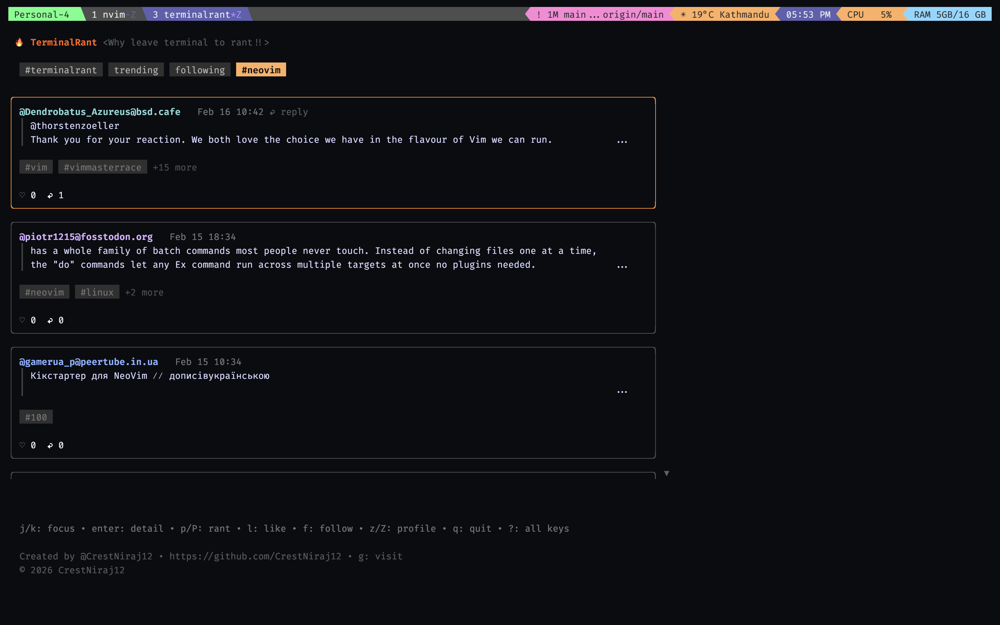

# TerminalRant

Ranting space for people who live in the terminal.

TerminalRant is a terminal UI (TUI) client for Mastodon. Read, post, reply,
moderate, and browse your timelines without leaving your shell.

## Quick Start

Install:

```sh
curl -fsSL https://raw.githubusercontent.com/CrestNiraj12/terminalrant/main/install.sh | bash
```

Run:

```sh
terminalrant
```

On first run, TerminalRant opens your browser for OAuth login and stores auth
state in `~/.config/terminalrant` by default.

## Screenshot



## Features

- OAuth login
- Feed tabs:
  - `#terminalrant`
  - `trending`
  - `following` (home timeline from followed users)
  - custom hashtag tab (only shown when custom tag differs from `terminalrant`)
- Switch tabs with `t` (next) and `T` (previous)
- Hashtag controls:
  - Change custom hashtag with `H`
  - Hashtags rendered as small capsules in feed/detail
  - Feed shows compact tags with `+N more`, detail shows all tags
- Media metadata rendering:
  - Feed shows compact media hint (image/video/audio counts + optional alt snippet)
  - Detail shows full media list with type, size (if available), alt text, and URL
- Phase 2 media previews:
  - ANSI image thumbnail preview for the selected post/reply (feed + detail)
  - Toggle previews with `i` (media rows show "preview hidden" when off)
  - Open selected media in browser with `I`
- Post creation and replies:
  - Compose with `$EDITOR` (`p` / `c`) or inline composer (`P` / `C`)
  - Optimistic posting/reply updates
- Post interactions:
  - Like/unlike (`l`)
  - Reply (`c`/`C`)
  - Open URL (`o`)
  - Edit/delete own posts (`e`/`E`/`d`)
- Moderation:
  - Hide post locally (`x`)
  - Toggle hidden posts (`X`)
  - Hidden posts shown in muted style with `HIDDEN` label when revealed
  - Block selected author (`b`) with confirmation
  - Manage blocked users dialog (`B`) and unblock with confirmation
- Following and profile:
  - Follow/unfollow selected author (`f`) with confirmation
  - Followed users are marked with `✓` beside username
  - Open selected author profile (`z`) to view name, bio, and recent posts
- Navigation:
  - Feed and detail views with keyboard navigation
  - Detail view supports full-page scrolling for long threads
  - Parent-thread jump from reply detail (`u`)
- Key help:
  - Minimal hints shown inline
  - Full key dialog via `?`
  - `q` closes dialogs/detail first before quitting from feed root
- Persistent UI state:
  - Remembers custom hashtag and selected feed tab between runs

## Requirements

- A Mastodon account
- Browser access for OAuth login

## Install

### Using go install (Go 1.25+)

```sh
go install github.com/CrestNiraj12/terminalrant@latest
```

Ensure `$GOPATH/bin` is in your PATH:

```sh
echo 'export PATH="$GOPATH/bin:$PATH"' >> ~/.zshrc
source ~/.zshrc
```

### Using installer script

The installer is pinned to `v0.2.0` and verifies downloaded binaries with
`checksums.txt` before installing.

Install to default directory:

```sh
curl -fsSL https://raw.githubusercontent.com/CrestNiraj12/terminalrant/main/install.sh | bash
```

Install to a custom directory:

```sh
curl -fsSL https://raw.githubusercontent.com/CrestNiraj12/terminalrant/main/install.sh | INSTALL_DIR="$HOME/.local/bin" bash
```

If `terminalrant` is not found after install, add your install directory to `PATH`:

```sh
echo 'export PATH="$HOME/.local/bin:$PATH"' >> ~/.zshrc
source ~/.zshrc
```

### Build from source

Clone and build locally (Go 1.25+):

```sh
go install ./...
```

Or run directly:

```sh
go run .
```

### Verify installation

```sh
terminalrant --version
```

## Configuration

TerminalRant is configured via environment variables:

- `TERMINALRANT_INSTANCE` — Mastodon instance base URL
  - Default: `https://mastodon.social`
- `TERMINALRANT_AUTH_DIR` — Directory used to store OAuth token/client state
  - Default: `~/.config/terminalrant`
- `TERMINALRANT_OAUTH_CALLBACK_PORT` — Local callback port for OAuth login
  - Default: `45145`
- `TERMINALRANT_HASHTAG` — Hashtag to follow (without `#`)
  - Default: `terminalrant`

## Usage

CLI flags:

- `--version`, `-v`, `-version` — print build/version info
- `--help`, `-h` — show usage

Start the app:

```sh
TERMINALRANT_INSTANCE="https://your.instance" terminalrant
```

On first run, TerminalRant opens a browser window for OAuth and stores auth
state under `TERMINALRANT_AUTH_DIR`.

If you prefer running from source:

```sh
TERMINALRANT_INSTANCE="https://your.instance" \
TERMINALRANT_HASHTAG="terminalrant" \
go run .
```

### Key bindings

Global:

- `?` — full keymap dialog
- `ctrl+c` — force quit
- `i` — toggle media previews
- `I` — open selected media

Feed:

- `j`/`k` or arrow keys — move
- `enter` — open detail
- `t` / `T` — next/previous tab
- `H` — set custom hashtag
- `r` — refresh
- `p` / `P` — new post (`$EDITOR` / inline)
- `c` / `C` — reply (`$EDITOR` / inline)
- `l` — like/unlike
- `e` — edit via `$EDITOR`
- `E` — edit inline
- `d` — delete own post (confirmation)
- `x` / `X` — hide post / toggle hidden posts
- `b` — block selected post author (confirmation)
- `f` — follow/unfollow selected post author (confirmation)
- `B` — blocked users dialog
- `z` — open selected author profile
- `Z` — open your own profile
- `o` — open post URL
- `g` — open creator GitHub
- `q` — quit (only when no dialog/detail is open)

Detail:

- `j`/`k` or arrow keys — move/scroll detail page
- `enter` — open selected reply thread
- `u` — open parent post
- `r` — refresh thread
- `l` — like/unlike selected
- `c` / `C` — reply
- `f` — follow/unfollow selected author (confirmation)
- `z` — open selected author profile
- `Z` — open your own profile
- `o` — open URL
- `esc` / `q` — back

Dialogs:

- `q` / `esc` — close dialog
- Block confirm: `y`/`n`
- Delete confirm: `y`/`n`
- Blocked users dialog:
  - `j`/`k` — select user
  - `u` — unblock selected (confirmation)

## Notes

- `#terminalrant` is always auto-appended on post/edit/reply if missing.
- For display, HTML returned from Mastodon is stripped for terminal rendering.
- UI state is stored in `ui_state.json` under `TERMINALRANT_AUTH_DIR`.

## Troubleshooting

- `terminalrant: command not found`
  - Add install dir to PATH (`~/.local/bin` by default) and reload shell.
- OAuth callback timeout
  - Ensure your browser can access `http://127.0.0.1:<port>/callback`.
  - Optionally set `TERMINALRANT_OAUTH_CALLBACK_PORT` to a free local port.
- Wrong server
  - Set `TERMINALRANT_INSTANCE="https://your.instance"` before launching.

## Development

- Dependencies are managed with Go modules (`go.mod`, `go.sum`).
- The UI is implemented with:
  - `github.com/charmbracelet/bubbletea`
  - `github.com/charmbracelet/bubbles`
  - `github.com/charmbracelet/lipgloss`

### Testing

- Run full fast suite (unit + local integration):

```sh
go test ./...
```

- Run focused race checks:

```sh
go test -race ./tui/feed ./infra/mastodon
```

- Generate coverage report:

```sh
go test -coverprofile=coverage.out ./...
go tool cover -func=coverage.out
```

- Run optional smoke tests against a real instance:

```sh
TERMINALRANT_BASE_URL="https://your.instance" \
TERMINALRANT_TOKEN="..." \
go test -tags=smoke ./...
```

- Allow mutating smoke cases (post/delete):

```sh
SMOKE_ALLOW_MUTATION=true \
TERMINALRANT_BASE_URL="https://your.instance" \
TERMINALRANT_TOKEN="..." \
go test -tags=smoke ./...
```

## License

MIT
